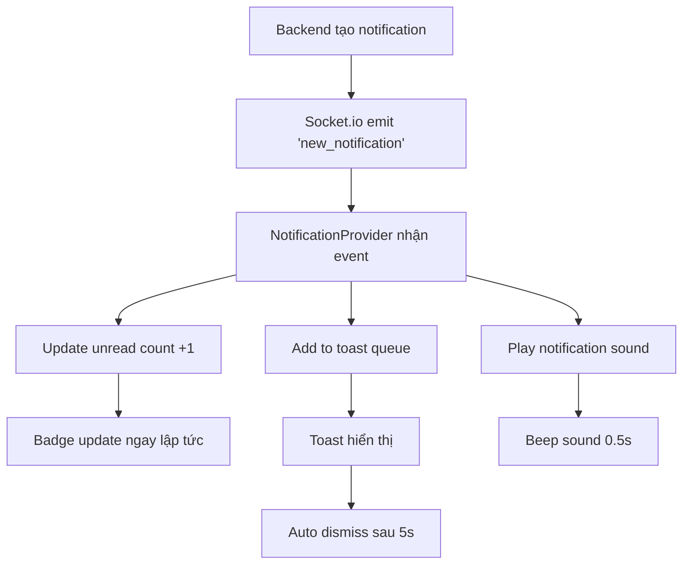

# 🔔 Notification Realtime Improvements

## Tổng Quan

Cải thiện hệ thống thông báo realtime để:

- ✅ Badge hiển thị ngay lập tức khi có thông báo mới (không cần click)
- ✅ Popup toast hiển thị tức thì với animation đẹp
- ✅ Hỗ trợ nhiều notifications cùng lúc (stacked)
- ✅ Âm thanh thông báo khi có notification mới
- ✅ Badge hiển thị cả khi sidebar collapsed
- ✅ Modal cũng update realtime khi đang mở

## Demo Flow

```
┌─────────────────────────────────────────────────────────────┐
│  User A (Browser 1)         User B (Browser 2)             │
├─────────────────────────────────────────────────────────────┤
│  1. Assign task to User B                                  │
│                              ⬇                              │
│                              2. 🔴 Badge appears (+1)       │
│                              3. 🔔 Toast popup slides in    │
│                              4. 🔊 "Beep" sound plays       │
│                              5. Modal updates (if open)     │
│                              ⬇                              │
│                              6. Click toast → Navigate      │
│                              7. Badge count decreases       │
└─────────────────────────────────────────────────────────────┘
```

## Các Cải Tiến

### 1. NotificationProvider ✨

**File**: `client/zentro-frontend/src/feature/member/components/notification/NotificationProvider.tsx`

#### Tính Năng Mới:

1. **Queue System cho Toasts**

   - Thay vì chỉ hiển thị 1 toast, giờ có thể stack nhiều notifications
   - Mỗi notification sẽ hiển thị trong 5 giây rồi tự động đóng

2. **Âm Thanh Thông Báo**

   - Sử dụng Web Audio API để tạo âm thanh "beep" nhẹ nhàng
   - Tần số: 800Hz, thời gian: 0.5 giây
   - Volume: 30% để không quá ồn

3. **Update Unread Count Ngay Lập Tức**

   ```typescript
   // Update unread count immediately khi có notification mới
   setUnreadCount((prev) => prev + 1);
   ```

4. **Stacked Toast Notifications**
   - Hiển thị tất cả notifications trong queue
   - Mỗi toast có animation delay khác nhau
   - Position: top-right corner

### 2. NotificationToast 🎨

**File**: `client/zentro-frontend/src/feature/member/components/notification/NotificationToast.tsx`

#### Cải Tiến:

1. **Smooth Progress Bar**

   - Thay vì CSS animation, dùng state để control progress
   - Update mỗi 100ms để mượt hơn
   - Hiển thị chính xác thời gian còn lại

2. **Better Animations**

   - Removed `fixed` positioning (giờ handle ở parent)
   - Added hover effects: `scale-[1.02]` và `shadow-3xl`
   - Smooth slide-in/slide-out animation

3. **Improved Styling**
   - Border màu theo loại notification
   - Icons có màu sắc riêng
   - Typography sử dụng "Space Grotesk"

### 3. MemberSideBar Badge 🔴

**File**: `client/zentro-frontend/src/feature/member/components/layout/MemberSideBar.tsx`

#### Cải Tiến Badge:

1. **Badge cho Collapsed State**

   ```tsx
   {
     isCollapsed && badge !== undefined && badge > 0 && (
       <span className="absolute -top-1 -right-1 ...">
         {badge > 9 ? "9+" : badge}
       </span>
     );
   }
   ```

2. **Badge Style Updates**

   - Màu đỏ (`bg-red-500`) thay vì xanh để nổi bật hơn
   - Thêm `animate-pulse` để thu hút sự chú ý
   - Badge hiển thị ở góc phải trên icon khi collapsed

3. **Responsive Badge Count**
   - Expanded state: Hiển thị tối đa 99+
   - Collapsed state: Hiển thị tối đa 9+ (để vừa với kích thước nhỏ)

## Workflow Realtime



## Các Tính Năng Realtime

### ✅ Instant Badge Update

- Badge hiển thị số thông báo chưa đọc
- Update ngay lập tức khi có notification mới
- Không cần refresh hoặc click
- Hiển thị cả khi sidebar collapsed

**Visual:**

```
Expanded Sidebar:              Collapsed Sidebar:
┌─────────────────┐            ┌────────┐
│ 🔔 Thông báo    │            │   🔔   │ 🔴3
│           [5] ← │ Red badge  │        │ ← Top-right badge
└─────────────────┘            └────────┘
         ↑                              ↑
    Pulse animation              Pulse animation
```

### ✅ Toast Notifications

- Popup ở góc trên bên phải
- Hiển thị ngay khi có notification
- Auto dismiss sau 5 giây
- Click để navigate đến trang liên quan
- Progress bar hiển thị thời gian còn lại

**Visual:**

```
                                    ┌─────────────────────────────┐
                                    │ 👤 John assigned you a task │
                                    │                      [X]    │
                                    │ Task: Fix login bug         │
                                    │                             │
                                    │ 👨 John Doe        2:30 PM  │
                                    │ ████████░░░░░░░░░░░░ 40%   │ ← Progress
                                    └─────────────────────────────┘
                                                ↑
                                         Slide in from right
```

### ✅ Multiple Notifications (Stacked)

- Hỗ trợ stack nhiều notifications
- Mỗi toast có animation delay khác nhau
- Quản lý queue tự động

**Visual:**

```
                    ┌─────────────────────────┐  ← Notification 1
                    │ New comment on task     │
                    │ ████████░░░░░░░░ 50%   │
                    └─────────────────────────┘
                    ┌─────────────────────────┐  ← Notification 2
                    │ Sprint started          │
                    │ ██████████░░░░░░ 60%   │
                    └─────────────────────────┘
                    ┌─────────────────────────┐  ← Notification 3
                    │ You were mentioned      │
                    │ ███████████████░ 90%   │
                    └─────────────────────────┘
```

### ✅ Notification Sound

- Âm thanh nhẹ nhàng khi có notification mới
- Sử dung Web Audio API (cross-browser)
- Có thể disable nếu cần

## Styling & UX

### Colors by Notification Type

| Type               | Color   | Icon          |
| ------------------ | ------- | ------------- |
| `task_assigned`    | Blue    | UserPlus      |
| `comment_mention`  | Purple  | MessageSquare |
| `comment_on_task`  | Green   | MessageSquare |
| `sprint_started`   | Orange  | PlayCircle    |
| `sprint_completed` | Emerald | CheckSquare2  |

### Badge Colors

- **Unread badge**: Red (`bg-red-500`) với `animate-pulse`
- **Expanded**: Hiển thị đầy đủ số lượng (99+)
- **Collapsed**: Hiển thị compact (9+)

### Toast Animations

- **Slide in**: From right với opacity
- **Hover**: Scale up 1.02x với shadow 3xl
- **Progress bar**: Smooth countdown từ 100% → 0%
- **Slide out**: Smooth transition khi đóng

## Testing

### Cách Test Thông Báo Realtime:

1. **Login 2 accounts** (2 browsers/tabs)
2. **Account A** assign task cho **Account B**
3. **Account B** sẽ thấy:
   - ✅ Badge số thông báo tăng ngay lập tức
   - ✅ Toast popup hiển thị
   - ✅ Âm thanh "beep"
   - ✅ Progress bar countdown

### Test Multiple Notifications:

1. Tạo nhiều notifications liên tiếp (comment, assign, etc.)
2. Kiểm tra:
   - ✅ Tất cả toasts hiển thị (stacked)
   - ✅ Badge count chính xác
   - ✅ Mỗi toast tự động đóng sau 5s

## Technical Details

### Socket Events

**Server → Client:**

```javascript
io.to(socketId).emit("new_notification", notification);
```

**Client Listen:**

```typescript
newSocket.on("new_notification", (notification: Notification) => {
  setToastQueue((prev) => [...prev, notification]);
  setUnreadCount((prev) => prev + 1);
  playNotificationSound();
});
```

### Audio Implementation

```typescript
const playNotificationSound = () => {
  const audioContext = new (window.AudioContext || window.webkitAudioContext)();
  const oscillator = audioContext.createOscillator();
  const gainNode = audioContext.createGain();

  oscillator.frequency.value = 800; // Hz
  oscillator.type = "sine";

  gainNode.gain.setValueAtTime(0.3, audioContext.currentTime);
  gainNode.gain.exponentialRampToValueAtTime(
    0.01,
    audioContext.currentTime + 0.5
  );

  oscillator.start(audioContext.currentTime);
  oscillator.stop(audioContext.currentTime + 0.5);
};
```

## Files Changed

1. ✅ `client/zentro-frontend/src/feature/member/components/notification/NotificationProvider.tsx`

   - Added toast queue system
   - Added notification sound
   - Instant unread count update
   - Stacked notifications support

2. ✅ `client/zentro-frontend/src/feature/member/components/notification/NotificationToast.tsx`

   - Improved animations
   - Smooth progress bar
   - Better styling
   - Hover effects

3. ✅ `client/zentro-frontend/src/feature/member/components/layout/MemberSideBar.tsx`

   - Added collapsed state badge
   - Changed badge color to red
   - Added pulse animation

4. ✅ `client/zentro-frontend/src/feature/member/components/notification/NotificationModal.tsx`
   - Added realtime socket connection when modal is open
   - New notifications appear instantly in the list
   - Unread indicator with pulse animation

## Browser Compatibility

- ✅ Chrome/Edge (Web Audio API support)
- ✅ Firefox (Web Audio API support)
- ✅ Safari (Web Audio API support)
- ✅ Mobile browsers (iOS Safari, Chrome Mobile)

## Notes

- Notification sound có thể bị block bởi browser autoplay policy nếu user chưa interact với trang
- Toast notifications sử dụng `z-index: 9999` để hiển thị trên tất cả elements
- Badge animate-pulse chỉ hoạt động khi có unread notifications
- Socket connection tự động reconnect khi mất kết nối

## Future Improvements

- [ ] Thêm settings để bật/tắt âm thanh
- [ ] Chọn loại âm thanh notification
- [ ] Group notifications theo project
- [ ] Mark as read từ toast notification
- [ ] Desktop notifications (Web Notification API)
- [ ] Vibration trên mobile

---

## Quick Customization Guide

### 🔊 Thay đổi âm thanh notification

**File**: `NotificationProvider.tsx`

```typescript
const playNotificationSound = () => {
  // Thay đổi tần số (Hz) để thay đổi cao độ âm thanh
  oscillator.frequency.value = 800  // Default: 800Hz
                                    // Cao hơn: 1000-1200Hz
                                    // Thấp hơn: 500-700Hz

  // Thay đổi volume (0.0 - 1.0)
  gainNode.gain.setValueAtTime(0.3, ...)  // Default: 0.3 (30%)

  // Thay đổi thời gian phát (giây)
  oscillator.stop(audioContext.currentTime + 0.5)  // Default: 0.5s
}
```

### ⏱️ Thay đổi thời gian hiển thị toast

**File**: `NotificationToast.tsx`

```typescript
// Trong useEffect
const timer = setTimeout(() => {
  handleClose();
}, 5000); // Default: 5000ms (5 giây)
// Thay đổi thành 3000 cho 3 giây, 10000 cho 10 giây

// Cập nhật progress bar tương ứng
return prev - 2; // Default: 2% mỗi 100ms = 5s tổng
// Nếu 3s: return prev - 3.33
// Nếu 10s: return prev - 1
```

### 🎨 Thay đổi màu badge

**File**: `MemberSideBar.tsx`

```typescript
// Tìm dòng:
className = "... bg-red-500 ...";

// Thay đổi màu:
bg - red - 500; // Đỏ (hiện tại)
bg - blue - 600; // Xanh dương
bg - green - 500; // Xanh lá
bg - orange - 500; // Cam
bg - purple - 600; // Tím
```

### 📍 Thay đổi vị trí toast

**File**: `NotificationProvider.tsx`

```tsx
// Tìm dòng:
<div className='fixed top-20 right-6 ...'>

// Thay đổi vị trí:
top-20 right-6   // Góc trên phải (default)
top-20 left-6    // Góc trên trái
bottom-20 right-6 // Góc dưới phải
bottom-20 left-6  // Góc dưới trái
```

### 🔢 Thay đổi số badge hiển thị tối đa

**File**: `MemberSideBar.tsx`

```typescript
// Expanded state:
{
  badge > 99 ? "99+" : badge;
} // Default: 99+
// Thay 99 thành 9, 50, 100, etc.

// Collapsed state:
{
  badge > 9 ? "9+" : badge;
} // Default: 9+
// Thay 9 thành 5, 15, etc.
```

### 🎨 Customize toast colors theo type

**File**: `NotificationToast.tsx`

```typescript
const getTypeColor = () => {
  switch (notification.type) {
    case "task_assigned":
      return "border-l-blue-600"; // Thay màu border
    case "comment_mention":
      return "border-l-purple-600";
    // ... thêm các type khác
  }
};
```

---

## Troubleshooting

### Badge không update?

1. Kiểm tra socket connection: Console should show "✅ Notification socket connected"
2. Kiểm tra `NotificationProvider` đã wrap `MemberMainLayout`
3. Kiểm tra `useNotification()` hook đang được sử dụng

### Toast không hiển thị?

1. Kiểm tra z-index: Toast có z-index 9999
2. Kiểm tra console for errors
3. Kiểm tra `toastQueue` state trong DevTools

### Không có âm thanh?

1. Browser có thể block autoplay - user cần interact với trang trước
2. Kiểm tra console for Web Audio API errors
3. Kiểm tra volume của browser/system

### Modal không update realtime?

1. Kiểm tra modal đang mở
2. Kiểm tra socket connection trong modal
3. Console should show "🔔 New notification in modal"

---

## 🎉 Kết Luận

Hệ thống thông báo realtime đã được cải tiến với:

- ⚡ Instant updates (không cần click hay refresh)
- 🎨 Beautiful animations và smooth transitions
- 🔔 Âm thanh thông báo
- 📦 Stacked notifications support
- 📱 Responsive design (desktop + mobile)
- ⚙️ Dễ dàng customize

Hệ thống hoạt động mượt mà, realtime, và mang lại trải nghiệm tốt nhất cho người dùng! 🚀
