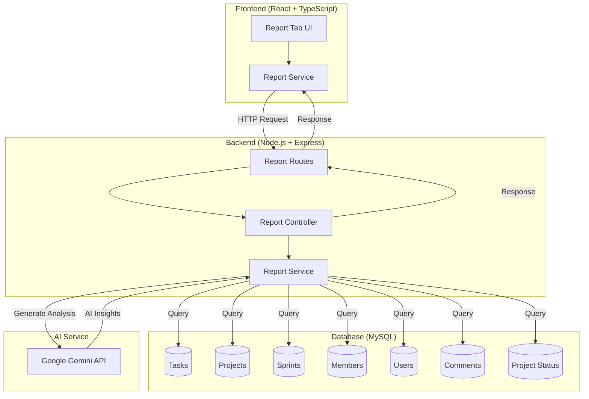
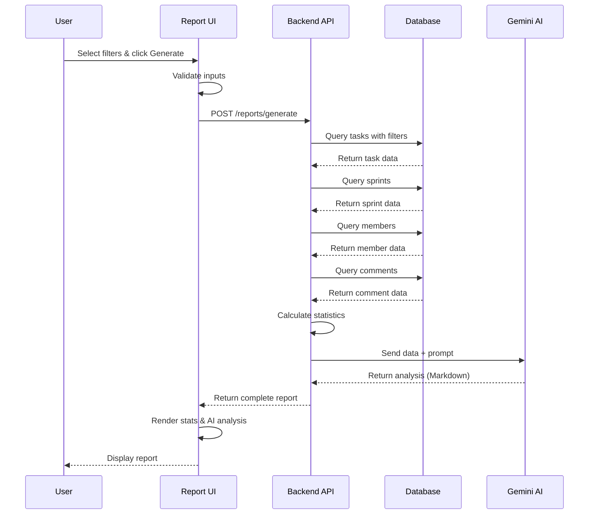
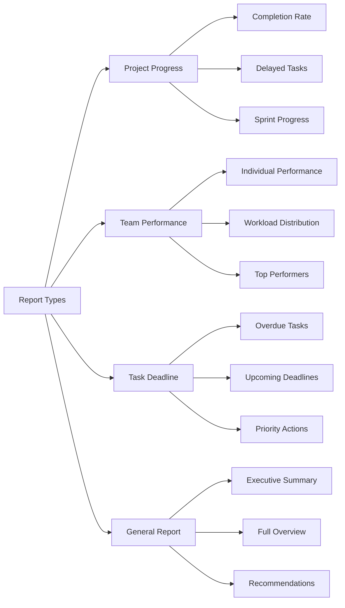
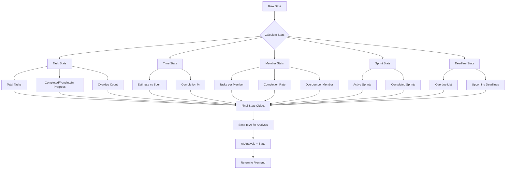
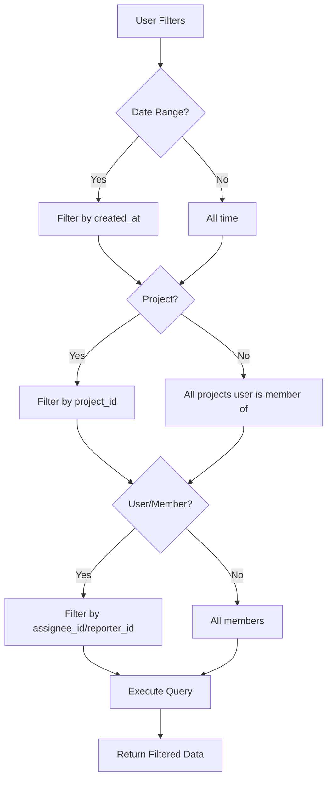
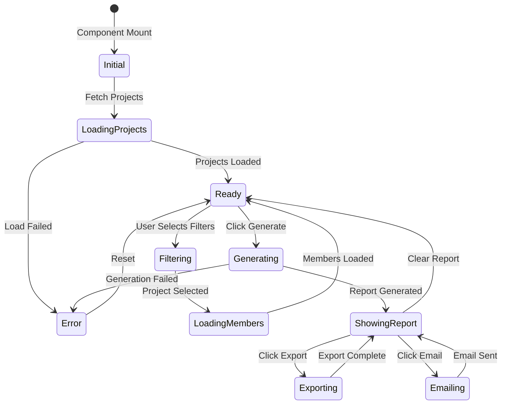
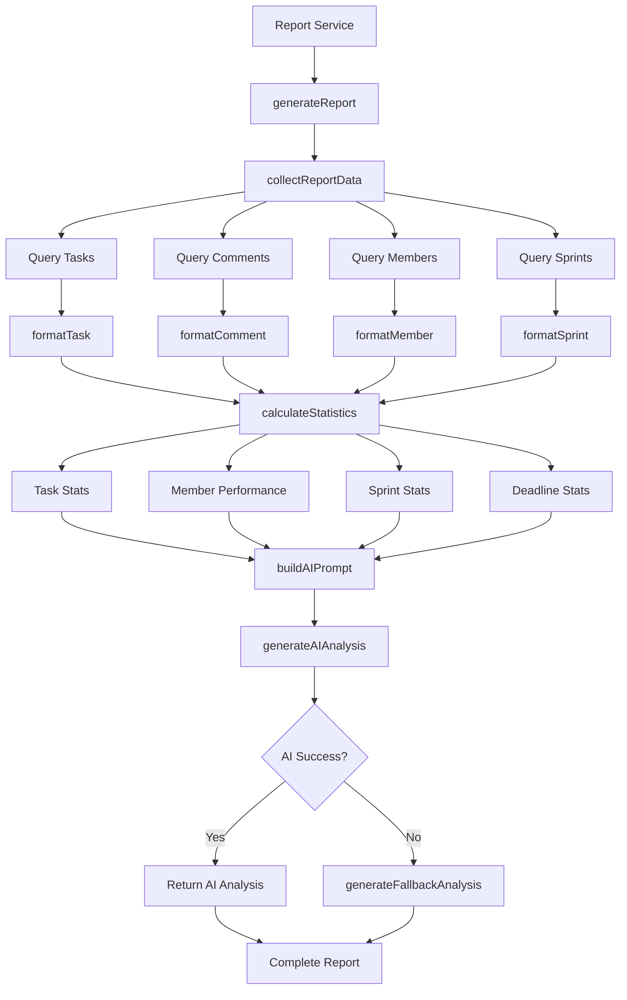
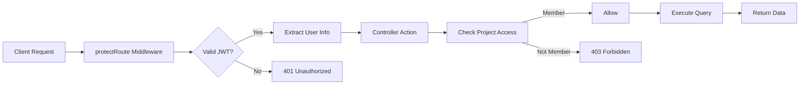

# Report Feature Architecture

## System Architecture Diagram



## Data Flow Diagram



## Component Structure

```
client/zentro-frontend/
├── src/
│   ├── feature/
│   │   └── admin/
│   │       ├── pages/
│   │       │   └── Report.tsx          ← Main report component
│   │       └── service/
│   │           └── report.service.ts   ← API calls
│   ├── types/
│   │   └── adminTab.ts                 ← Menu configuration (updated)
│   └── App.tsx                         ← Routes (updated)

server/
├── controllers/
│   └── report.controller.js            ← API endpoints
├── services/
│   └── report.service.js               ← Business logic + AI
├── routes/
│   └── report.routes.js                ← Route definitions
└── app.js                              ← Integrated routes
```

## Report Types & Use Cases



## Statistics Calculation Flow



## Filter Logic



## UI State Management



## Backend Service Methods



## API Endpoint Structure

```
/api/v1/reports/
├── GET /projects
│   └── Returns: List of projects user is member of
│
├── GET /team-members/:projectId
│   └── Returns: List of team members for project
│
├── POST /generate
│   ├── Body: { reportType, startDate, endDate, projectId?, userId? }
│   └── Returns: { reportType, filters, data, aiAnalysis, generatedAt }
│
├── POST /export-pdf
│   ├── Body: Report data
│   └── Returns: PDF file (placeholder)
│
└── POST /send-email
    ├── Body: { report, recipients }
    └── Returns: Success message (placeholder)
```

## Security & Authentication



---

**Note:** This architecture is designed to be scalable and maintainable, following the existing codebase patterns.
